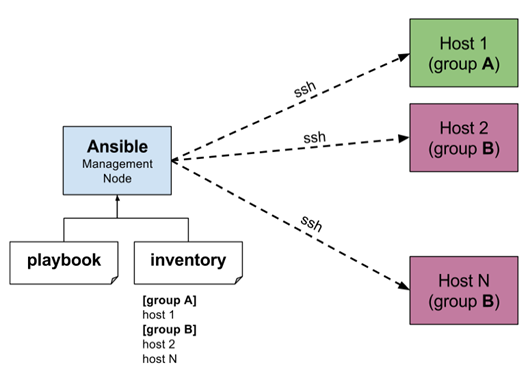

[Main Menu](../../../sessions/README.md) |[session2](../../session2/) | [Session 2 Notes](../docs/sessionNotes.md)

# Session 2 Notes - Automated provisioning of servers using Ansible

## Recap - vagrant provisioning

In [session1](../../session1/) we saw how we could quickly provision virtual machines for experiments using Vagrant.
We also saw how we could include bash command scripts to run after the machine was booted.
This allows us to add software to provisioned virtual machines for use in experiments.

You were left with an exercise to provision the Apache Web Server on a RHEL/Rocky Linux machine and on an Ubuntu machine.

Answers to this exercise are in [session2/vagrant-examples/example2-1](../../session2/vagrant-examples/example2-1).

---
**Exercise 2.1**

Go through the [session2/vagrant-examples/example2-1](../../session2/vagrant-examples/example2-1) examples and make sure you understand how the provisioning works.
* how do ubuntu and rocky differ in provisioning
* how is the web page injected into the machines

---

## Provisioning multiple machines with shared keys and passwords and a host only network

So far we have relied on Vagrant to provision a `vagrant` user which can be used for login using `vagrant ssh`

The vagrant user has no password login and `vagrant ssh` relies on vagrant generated private keys placed in the `.vagrant` folder.

For our work going forwards, we will need to provision machines with additional users (`admin` and `ansible`) which can be accessed using passwords and SSH directly without Vagrant.

The machines provisioned so far have had only one `Network Interface Card (NIC)` which is connected to a `Network Address Translation (NAT)` network in VirtualBox. 

This provides the the gateway to the Internet and DNS services through the host.

Virtual Box uses `Dynamic Host Control Protocol (DHCP)` to automatically allocate each virtual machine an IP address. 
VirtualBox translates that address into a mapped port on the host computer's network. 
This allows the virtual machine to talk to the Internet an but it does not allow the host or the Internet to connect directly to the virtual machine.

We will now create in each machine a second NIC connected to a `Host Only Network` which is directly connected to a virtual NIC in the host. 

This allows the machines to talk to each other and to the host but not outside the host.

Instead of using DHCP, vagrant will provision a static IP address for each machine so that we know which machine is mapped to which IP address.

We create new users with passwords and also corresponding private and public SSH keys to allow authentication between the machines using SSH.

---
**Exercise 2.2**

Look at the vagrant files and scripts in  [session2/vagrant-examples/example2-2](../../session2/vagrant-examples/example2-2)  which provisions 3 machines.
* make sure you understand how the three machines are provisioned.
* How do the network insterfaces get IP addresses
* Can you ssh between the machines using both passwords and ssh keys

---

|Name               |IP Address eth0                       | ip address eth1                        | Operating System            | Notes              |
|:------------------|:-------------------------------------|:---------------------------------------|:----------------------------|:-------------------|
|ansible-controller | DHCP Gateway 10.0.2.1/24          | 192.168.56.10  Gateway 192.168.56.1 | Ubuntu 24.04                | installed ansible  |
|ubuntu-1           | DHCP Gateway 10.0.2.1/24          | 192.168.56.20  Gateway 192.168.56.1 | Ubuntu 24.04                |                    |
|rocky_1            | DHCP Gateway 10.0.2.1/24          | 192.168.56.30  Gateway 192.168.56.1 | Rocky linux 9.6             |                    |
|host               | NAT 10.0.2.1/24                   | 192.168.56.1  (host)                   | Windows                     |                    |

Three scripts are used to provision the vms

generate-ansible-ssh.sh  used to generate ansible user SSH keys in shared folder /vagrant/.ssh-keys

provision-users-rhel.sh  used to create users on RHEL/Rocky machines

provision-users-ubuntu.sh used to create users on on Ubuntu machines

He following users are created

| User Name       | Password    | SSH Key                                                                                |
|:----------------|:------------|:---------------------------------------------------------------------------------------|
| vagrant         | NONE        | SSH Key Only `/home/vagrant/.ssh` and in `/vagrant/.vagrant` (vagrant ssh)  |
| ansible         | minad1234   | SSH Key in   `/home/ansible/.ssh` and in `/vagrant/.ssh-keys`               |
| admin           | minad1234   | no SSH Key user                                                                        |

# Starting to use ansible

Ansible is an open source provisioning orchestration system curated by RedHat

   
   
Some ansible projects are conveniently provided in the `/vagrant/ansible` folder which you should try as an introduction.

---
**Exercise 2.3**
Go through the [session2/vagrant-examples/example2-2/ansible/project-ansible2-1](../../session2/vagrant-examples/example2-2/ansible/project-ansible2-1) examples to run a simple set of ansible commands
* can you ping the servers using ansible
---

---
**Exercise 2.4**

Go through the [session2/vagrant-examples/example2-2/ansible/project-ansible2-2](../../session2/vagrant-examples/example2-2/ansible/project-ansible2-2) examples to run a simple set of ansible playbooks
* how do ubuntu and rocky differ in provisioning
* how is the web page injected into the machines

---

Following that first attempt, there are some quite good tutorials here which you can adapt to your set up

[Getting Started with Ansible: A Beginner’s Guide](https://dev.to/anushree_gm/getting-started-with-ansible-a-beginners-guide-3deh )

[Ansible Fundamentals Beyond the First Playbook](https://dev.to/anushree_gm/ansible-fundamentals-beyond-the-first-playbook-2gb4 )

Can you adapt any of these tutorials to run in your server?
If you work through these tutorials, you do not need to install ansible because it is already installed on the `ansible controller` machine and the ansible .ssh keys are already generated.

