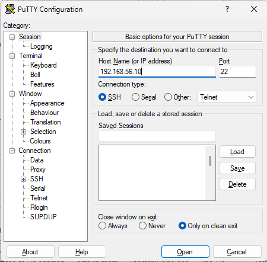
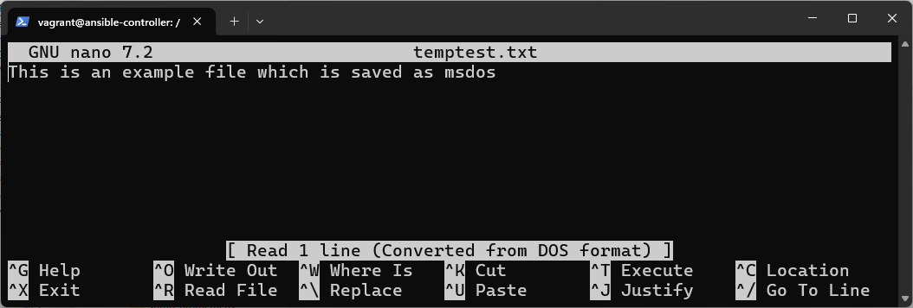
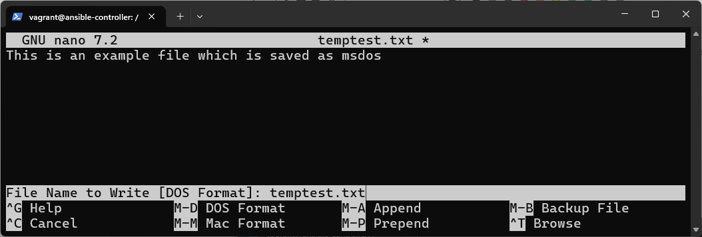
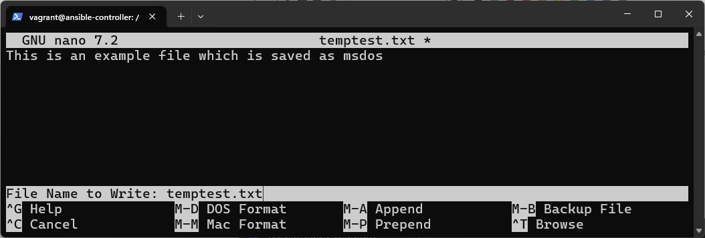

# Example 2-2 Multiple machines with shared user keys

To run the example use

```
cd example2-2

vagrant up
```

This will start 3 machines, one after another.

The gui for each machine will automatically start as well because of the directive

```
vb.gui = true
```

you can use `vagrant status` to see the three machines


```
vagrant status
Current machine states:

ansible_controller        running (virtualbox)
ubuntu_1                  running (virtualbox)
rocky_1                   running (virtualbox)
```

Because we have 3 separately named machines starting in the same project, we need to specify which machine we are connection to using `vagrant ssh`

```
vagrant ssh ansible_controller # or ubuntu_1 or rocky_1
```

This will land you in the `vagrant` user account

From this account you can ssh into the other machines using the ansible or the admin user.
If you do this from the vagrant account, you will be asked for passwords (minad1234)

Try 

```
ssh ansible@192.168.56.20    #ubuntu_1

ssh ansible@192.168.56.30    #rocky_1
```
in both cases asked for password  `minad1234`

However, if we use `sudo su ansible` to switch to the ansible account, the ssh public and private keys are shared between the machines.

```
sudo su ansible
```
In the ansible account, you will be automatically authenticated as the ansible user to the other machines

```
ssh 192.168.56.20    #ubuntu_1

ssh 192.168.56.30    #rocky_1
```

You can also try using putty to ssh into the machines from your host machine.

(putty is available to download from the [Putty download site](https://www.chiark.greenend.org.uk/~sgtatham/putty/) or from [microsoft store](https://apps.microsoft.com/detail/xpfnzksklbp7rj?hl=en-GB&gl=GB)

   
 
 
   
Once you have completed the basic ssh tests, move on the ansible examples in the [ansible](./ansible) folder.

## Additional notes and gotchas

### Problems with cpu in ubuntu 24.04

There is a known bug in the ubuntu 24.04 bento box which prevents it working correctly with more than one virtual cpu in  VirtualBox.
Using a higher cpu count can cause the VM to hang due to a race conditions between threads.

```
vb.cpus = 1
```

### wrong MSDOS file endings in files imported with shared `\vagrant` folder

One problem which can occur is that any files edited on a windows machine may have different encoding and line endings when run on a linux machine.

(Using an IDE like Eclipse to edit files rather than Notepad in windows can help with this if eclipse is set to use UTF-8 and Unix lines)

Note that embedded scripts in vagrant are handled correctly but calling in external `.sh` files can be a problem.

Sometimes the /vagrant directory which is shared with a windows host may have problems with the wrong line endings on the files (windows uses new line \ carriage return while linux only uses carriage return)

if this is the case for a file you will see errors like

```
sh additional-config.sh
additional-config.sh: line 2: $'\r': command not found
```

This can be fixed manually in the virtual machine by editing the file in the linux box using nano. 

When you write the file, you may see 'saving as MSDOS'

   
   
   
   
You can save as a linux file by using windows ALT with D key to change the save format from MSDOS to linux.
      
   

Once the format is changed, it should be mapped correctly when checked into github.

Another approach can be to fix the files in the virtual machine using sed with option -i for in-place editing, we delete the trailing \r directly in the input file.

```
sed -i 's/\r$//' filename
```


