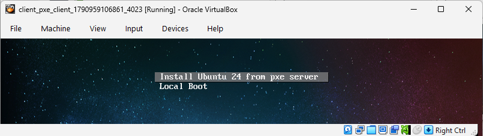

# Vagrant PXE test environment

Forked and modified from https://github.com/eoli3n/vagrant-pxe/tree/pxelinux 

A vagrant PXE client/server environment which supports virtualbox providers.  

It is designed to learn and test cloning solutions, nfsroot, syslinux, etc...

---
**Exercise 4.1**

Follow the notes below to run a PXE server and a PXE client to simulate an installation of an operating system onto a bare metal server
* Make sure you undertand what the server is doing
* Try booting the client into Rocky Linux first
* Restart and let the client install Ubuntu
* Now restart the client and do a local boot - it should start up Ubuntu from disk. 

---

## start pxe server

```
cd server
vagrant up
```
The first time you run this project, the example will download an ubuntu 24 iso into `server/www/sharedisos`
This will take about 15 minutes. 
Once you have done this, as long as the iso is present, the example will not need to do it again. 
You can speed things up if you already have the ubuntu-24.04.5-live-server-amd64.iso and place it in the directory.

Note that all `.iso` files are excluded from git by the `.gitignore` file

## start client server

Once the pxe server is up, you can start the client server.

```
cd client
vagrant up
```

The client first loads a rocky linux box. 

We are actually going to pxe boot an ubuntu machine but vagrant needs a box to start up.

Looking at the virtualbox ui for the client machine, you will see it first attempts a pxe boot using the pxe boot server.



You will be presented with a menu for either selecting `Install ubuntu server from pxe boot` or `Local Boot`.

If you choose to `Local Boot` at this point, you will boot into rocky linux which has already been installed in the drive by vagrant.

If you choose `Install ubuntu server from pxe boot`, the pxe boot installation process will start and will overwrite rocky linux on the disk with ubuntu.

Once the installation process has completed, the machine will reboot and will present you with the original pxe boot screen.
However if you choose `Local Boot`, you will now boot into the newly installed Ubuntu server.

You can log into the Ubuntu server using the credentials

user: ansible
password: minad1234

(Note that the vagrant command line will appear to fail or time out because it cannot SSH into the machine since it no longer is a vagrant box).


---
**Exercise 4.2**

Install ansible on the pxe server and use it to install apache on the new Ubuntu machine
* modify the pxe-server vagrant script  to provision an ansible user and to install ansible on the pxe server
* create and test an ansible script to install apache on the new Ubuntu machine

---


**Refs**

* http://www.syslinux.org/wiki/index.php?title=PXELINUX
* https://help.ubuntu.com/community/DisklessUbuntuHowto

